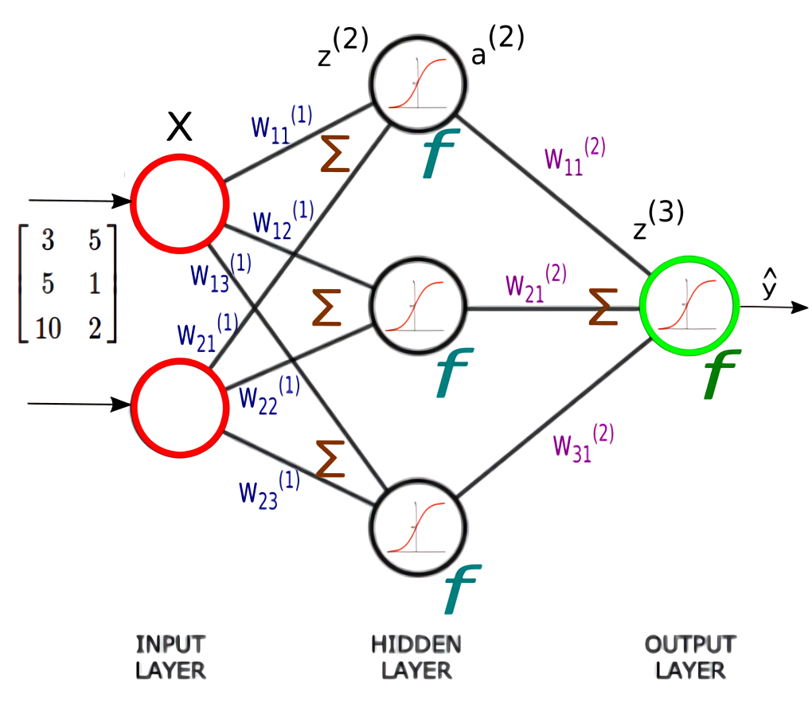

# MathDNN - A deep mathematical understanding of DNNs

🤓📐 An explanation of dense neural networks (DNN) in a complete mathematical approach. The purpose of this project is using the open source software `LaTeX` to do a theoretical explanation with - definitions, propositions, theorems and proofs.

# Want to edit the document yourself ?

- I am using `Visual Code Studio` as my editor and `TeX Live` as my TeX distribution.
- Download the VS extension `LaTeX Workshop` by James Yu.
- Then follow his tutorial [`Installation and basic settings`](https://github.com/James-Yu/LaTeX-Workshop/wiki/Install).
- Open the [document](mathdnn/paper.tex) with your LaTeX editor.
- You are ready to edit the document! 🎉🎉
- To export as PDF from the [`paper.tex`](mathdnn/paper.tex) file click on the icon ▶️ on top right of your VS UI.

# References

- [Neural Networks from Scratch in Python](https://nnfs.io/)

# Draft references

## Differentiability

- [Cours de calcul différentiel Licence de mathématiques, 3ème année](https://perso.math.u-pem.fr/danchin.raphael/cours/calculdiff10.pdf)
- [2.3 Dérivabilité en plusieurs variables](https://www.ljll.math.upmc.fr/~nardoni/polyagrl3/2017/chapt3.pdf)
- [Matrix Differentiation](https://atmos.washington.edu/~dennis/MatrixCalculus.pdf)
- [Jacobian and Chain Rule](https://www.youtube.com/watch?v=GvwsCscqAjk)

## Optimization

- [10-725: Optimization](https://www.stat.cmu.edu/~ryantibs/convexopt-F13/scribes/lec6.pdf)
- [Convergence Theorems for Gradient Descent](https://gowerrobert.github.io/pdf/M2_statistique_optimisation/grad_conv.pdf)
- [L1 Analyse : démonstration de la formule de Taylor avec reste intégral](https://www.youtube.com/watch?v=Hr6BaVbrkOw)
- [COURS OPTIMISATION](http://math.univ-lyon1.fr/~ciuperca/optim-M1-sitn/cours-optim-M1-sitn.pdf)
- [An Improved Analysis of Stochastic Gradient Descent with Momentum](https://proceedings.neurips.cc/paper/2020/file/d3f5d4de09ea19461dab00590df91e4f-Paper.pdf)