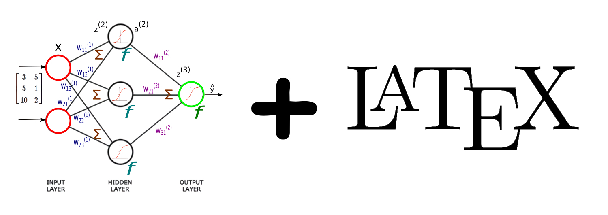
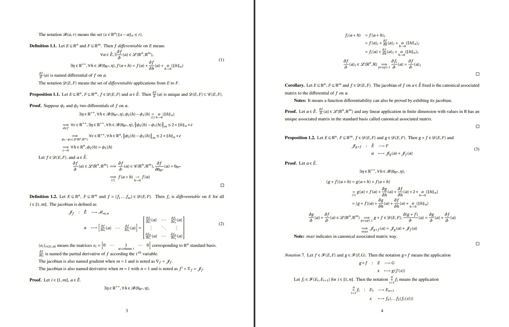

# MathDNN - A deep mathematical understanding of DNNs

[](https://www.tug.org/texlive/)



🤓📐 An explanation of dense neural networks (DNN) in a complete mathematical approach. The purpose of this project is using the open source software `LaTeX` to do a theoretical explanation with - definitions, propositions, theorems and proofs.

# Extract



The [**link**](https://github.com/iLoveDataJjia/mathdnn/raw/main/mathdnn/paper.pdf) 😍 for the complete document in PDF format.

# Want to contribute ?

- I am using `Visual Code Studio` as my editor and `TeX Live` as my TeX distribution.
- Download the VS extension `LaTeX Workshop` by James Yu.
- Then follow his tutorial [`Installation and basic settings`](https://github.com/James-Yu/LaTeX-Workshop/wiki/Install).
- Open the [document](mathdnn/paper.tex) with your LaTeX editor.
- You are ready to edit the document! 🎉🎉
- To export as PDF from the [`paper.tex`](mathdnn/paper.tex) file click on the icon ▶️ on top right of your VS UI.

# Using MathDNN as a reference ?

```
@misc{ilovedatajjiamathdnn,
  author = {James Jiang and Alex Jiang},
  title = {MathDNN - A deep mathematical understanding of DNNs},
  year = {2022},
  url = {https://github.com/iLoveDataJjia/mathdnn}
}
```

# Main references

- [ElegantPaper](https://github.com/ElegantLaTeX/ElegantPaper)
- [Neural Networks from Scratch in Python](https://nnfs.io/)
- [Convergence Theorems for Gradient Descent](https://gowerrobert.github.io/pdf/M2_statistique_optimisation/grad_conv.pdf)

# Other references

- [New Convergence Aspects of Stochastic Gradient Algorithms](https://lamnguyen-mltd.github.io/files/new_aspects_sgd.pdf)
- [An Improved Analysis of Stochastic Gradient Descent with Momentum](https://arxiv.org/pdf/2007.07989.pdf)
- [Why Momentum Really Works](https://distill.pub/2017/momentum/)